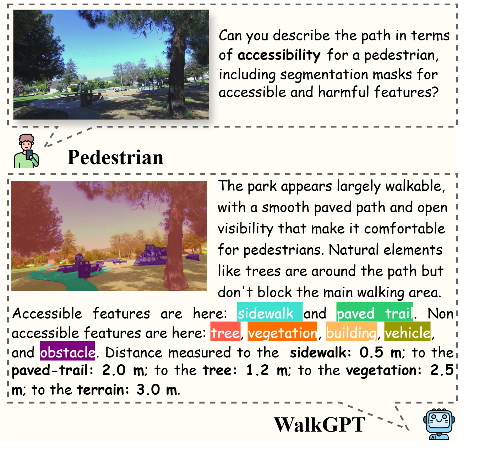
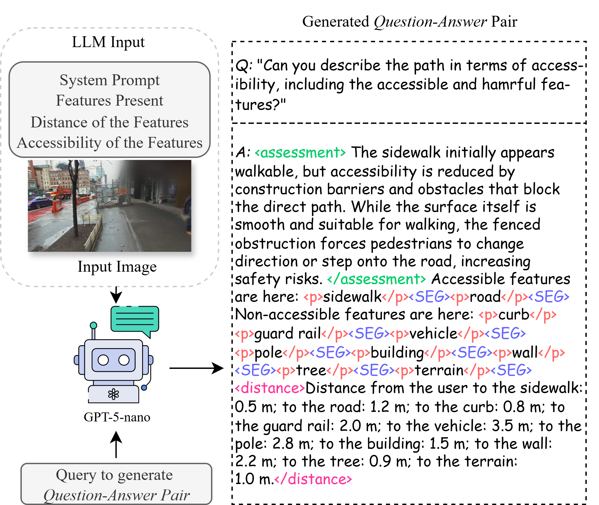
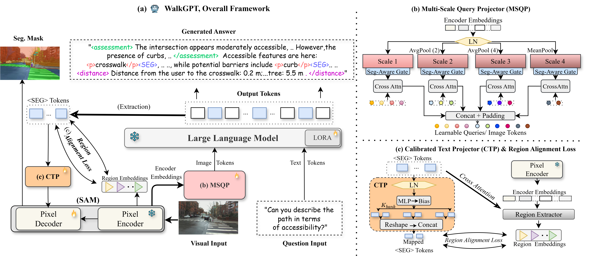

# WalkGPT

> **WalkGPT: Grounded Vision–Language Conversation with Depth-Aware Segmentation for Pedestrian Navigation**
> Rafi Ibn Sultan, Hui Zhu, Xiangyu Zhou, Chengyin Li, Prashant Khanduri, Marco Brocanelli, Dongxiao Zhu
> Accepted at **CVPR 2026**  
> 📄 Paper link: *Coming soon*

WalkGPT is a pixel-grounded vision–language model for accessibility-aware navigation with depth-aware segmentation and structured reasoning.

---

## Abstract

Ensuring accessible pedestrian navigation requires reasoning about both semantic and spatial aspects of complex urban scenes, a challenge that existing Large Vision–Language Models (LVLMs) struggle to meet. Although these models can describe visual content, their lack of explicit grounding leads to object hallucinations and unreliable depth reasoning, limiting their usefulness for accessibility guidance. We introduce **WalkGPT**, a pixel-grounded LVLM for the new task of *Grounded Navigation Guide*, unifying language reasoning and segmentation within a single architecture for depth-aware accessibility guidance. Given a pedestrian-view image and a navigation query, WalkGPT generates a conversational response with segmentation masks that delineate accessible and harmful features, along with relative depth estimation. The model incorporates a **Multi-Scale Query Projector (MSQP)** that shapes the final image tokens by aggregating them along text tokens across spatial hierarchies, and a **Calibrated Text Projector (CTP)**, guided by a proposed Region Alignment Loss, that maps language embeddings into segmentation-aware representations. These components enable fine-grained grounding and depth inference without user-provided cues or anchor points, allowing the model to generate complete and realistic navigation guidance. We also introduce **PAVE**, a large-scale benchmark of 41k pedestrian-view images paired with accessibility-aware questions and depth-grounded answers. Experiments show that WalkGPT achieves strong grounded reasoning and segmentation performance.
<!-- <p align="center">
  
</p> -->
---

## 🤗 Dataset: PAVE
<p align="center">
  
</p>
PAVE (Pedestrian Accessibility Vision–Language Dataset) is publicly available on Hugging Face:

👉 https://huggingface.co/datasets/rafiibnsultan1/PAVE

The dataset contains 41k pedestrian-view image–question–answer triplets with structured grounding tokens, segmentation alignment, and depth-aware annotations.

---
## Architecture


## Key Contributions

- Pixel-grounded LVLM tailored for pedestrian accessibility navigation  
- Unified architecture for segmentation, spatial reasoning, and conversational guidance  
- Multi-Scale Query Projector (MSQP) for hierarchical visual grounding  
- Calibrated Text Projector (CTP) with Region Alignment Loss for fine-grained token–region alignment  
- Introduction of the PAVE benchmark for accessibility-aware spatial reasoning  

---


## Repository Structure

```text
WalkGPT/
│
├── configs/                     
├── datasets/                    
├── model/                    
├── utils/                      
│
├── train_walkgpt.py             # Training script
├── evaluation_walkgpt.py        # Evaluation script
├── merge_lora_weights_and_save_hf_model.py
├── instructions.md              # Prompt templates
├── requirements.txt             # Python dependencies
└── LICENSE
```


---

## ⚙️ Installation

Clone the repository:

```bash
git clone https://github.com/rafiibnsultan1/WalkGPT.git
cd WalkGPT
```

Install dependencies:
```bash
pip install -r requirements.txt
```

Check the instructions for training and evaluation in instructions.md

## 🔗 Acknowledgments

This work builds upon and benefits from several outstanding open-source contributions:

- [PixelLM](https://github.com/MaverickRen/PixelLM) — for their open-source grounding framework that helped shape our implementation.
- [SANPO Dataset](https://github.com/google-research-datasets/sanpo_dataset) — whose real-world pedestrian images made this research possible.

We sincerely thank the authors for making their resources publicly available.

## Citation

If you find this work useful in your research, please cite:

```bibtex
@inproceedings{walkgpt2026,
  title={WalkGPT: Grounded Vision–Language Conversation with Depth-Aware Segmentation for Pedestrian Navigation},
  author={Rafi Ibn Sultan, Hui Zhu, Xiangyu Zhou, Chengyin Li, Prashant Khanduri, Marco Brocanelli, Dongxiao Zhu},
  booktitle={Proceedings of the IEEE/CVF Conference on Computer Vision and Pattern Recognition (CVPR)},
  year={2026}
}
